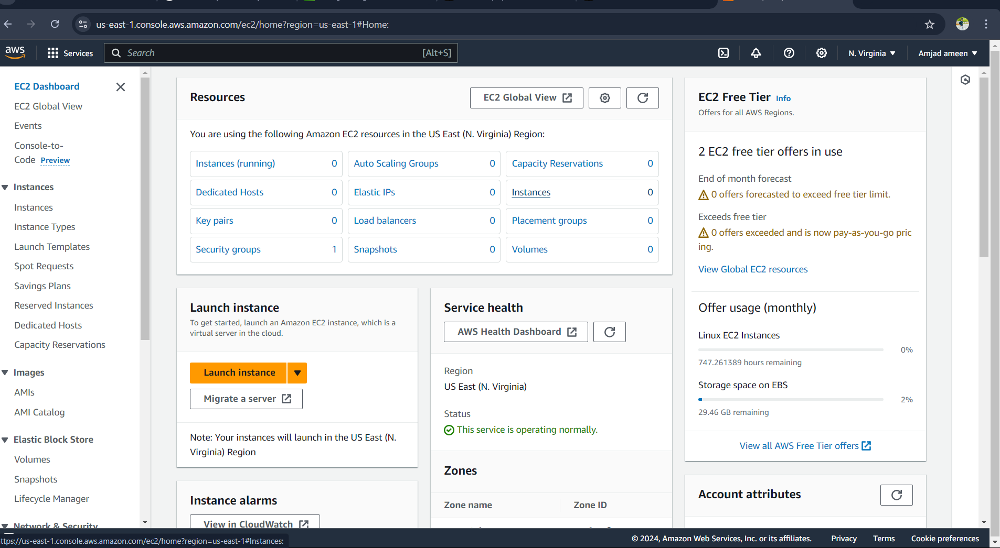
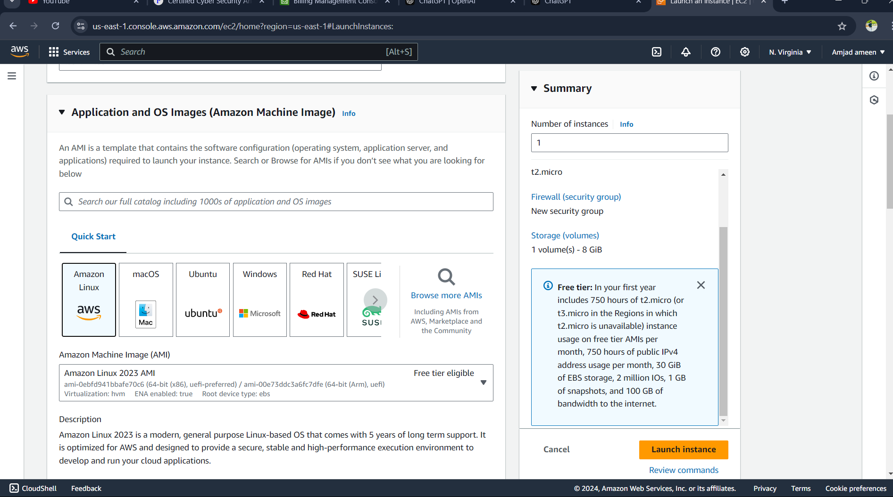
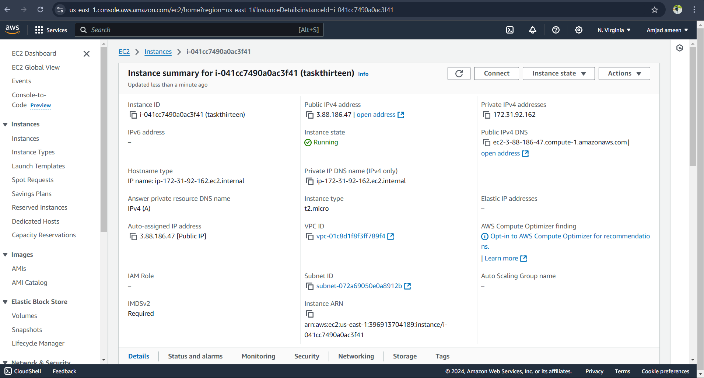

# AWS EC2 Setup, Ping, SSH Access & Termination

This guide walks through launching an AWS EC2 instance, performing ping tests, logging in via SSH from Kali Linux, and terminating the instance.

## Step 1: Log in to AWS Management Console
- Open a browser and go to the [AWS Management Console](https://aws.amazon.com/console/).
- Sign in with your credentials.

## Step 2: Launch a New EC2 Instance
1. Navigate to **EC2 Dashboard** by searching for EC2 in the AWS console.
2. Click **Launch Instance** and select an Amazon Machine Image (AMI) (e.g., Ubuntu, Amazon Linux).
   
3. Choose an instance type (e.g., `t2.micro` for free tier).
   
4. Configure instance details, security groups:
   - Add an SSH rule (port 22) to allow access from your IP.
   - Add a rule for **ALL ICMP-IPv4** to allow IPv4 access for ping tests.
   
5. Review settings and **Launch**. Select or create a key pair, and download it for SSH access.

## Step 3: Get Instance Public IP
1. Once the instance is running, go to the **Instances** section.
2. Locate your instance and find the **Public IPv4 Address** under the description tab.
   - Public IP: **3.88.186.47**
   

## Step 4: Ping the EC2 Instance from Kali Linux
1. Verify the instance is running and has a public IP.
2. Ensure that ICMP traffic is allowed in the security group.
3. Open a terminal in Kali Linux and ping the EC2 instance:
   ```bash
   ping 3.88.186.47
Step 5: SSH into the EC2 Instance from Kali Linux
Ensure the .pem file has correct permissions:
chmod 400 /path/to/your-key.pem

SSH into the instance using the appropriate username (e.g., ubuntu for Ubuntu):

ssh -i /path/to/your-key.pem user@ip address

Step 6: Terminate the EC2 Instance
Navigate to the Instances section in the EC2 Dashboard.
Select the instance, go to Instance State, and choose Terminate.
Screenshots
Include all referenced screenshots in the repository:

screenshot-2.png ,

screenshot-3.png ,

screenshot-4.png ,

screenshot-5.png ,

screenshot-6.png ,

screenshot-7.png ,

screenshot-8.png ,

screenshot-terminate.png


